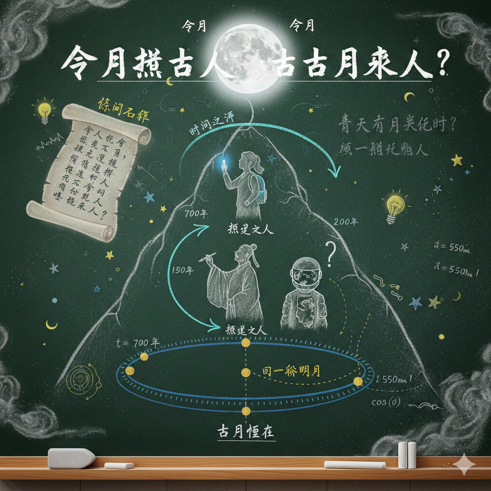
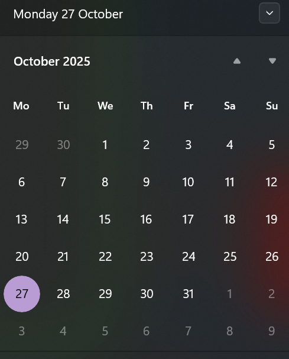
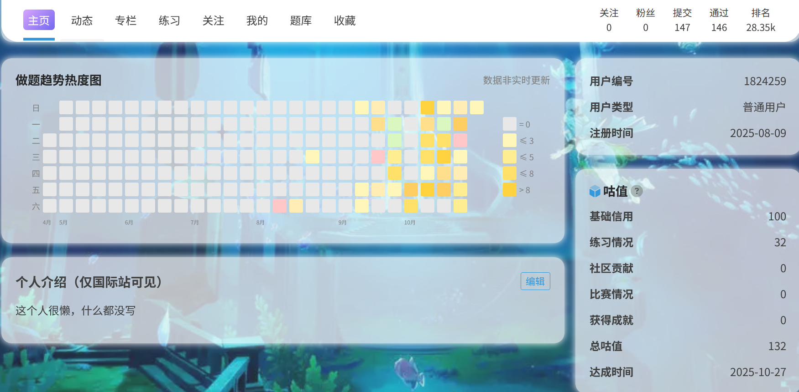
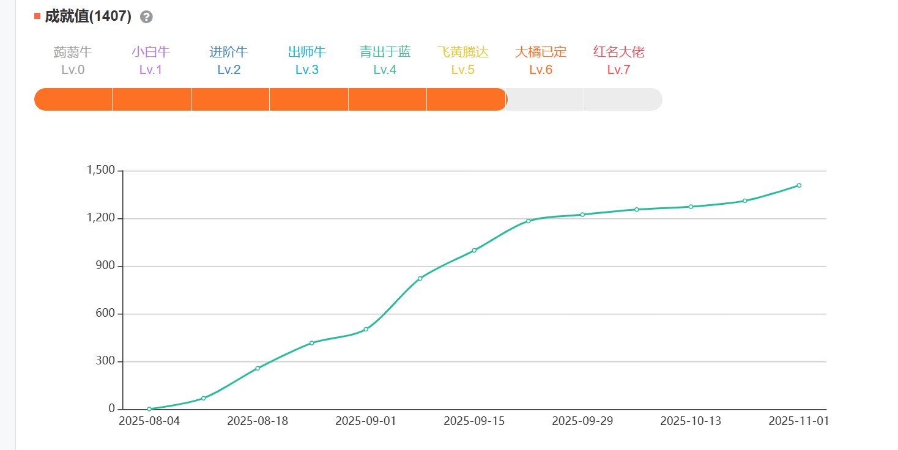
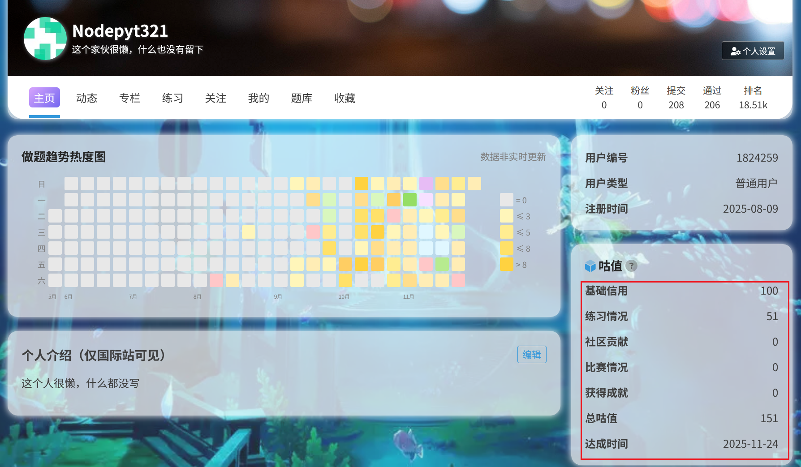
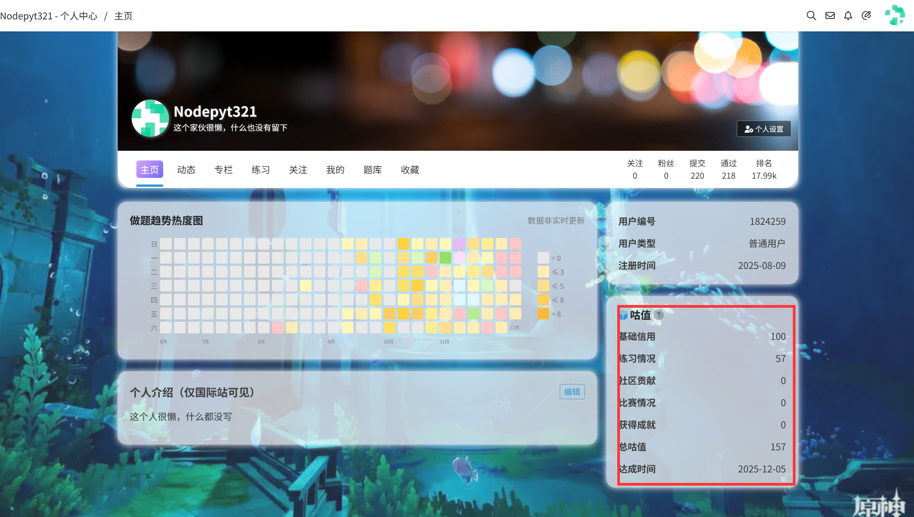
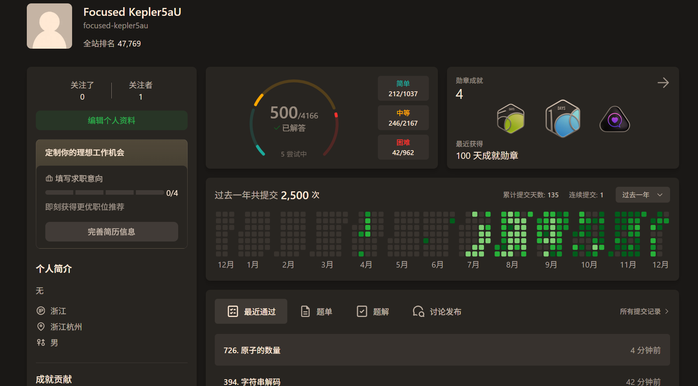
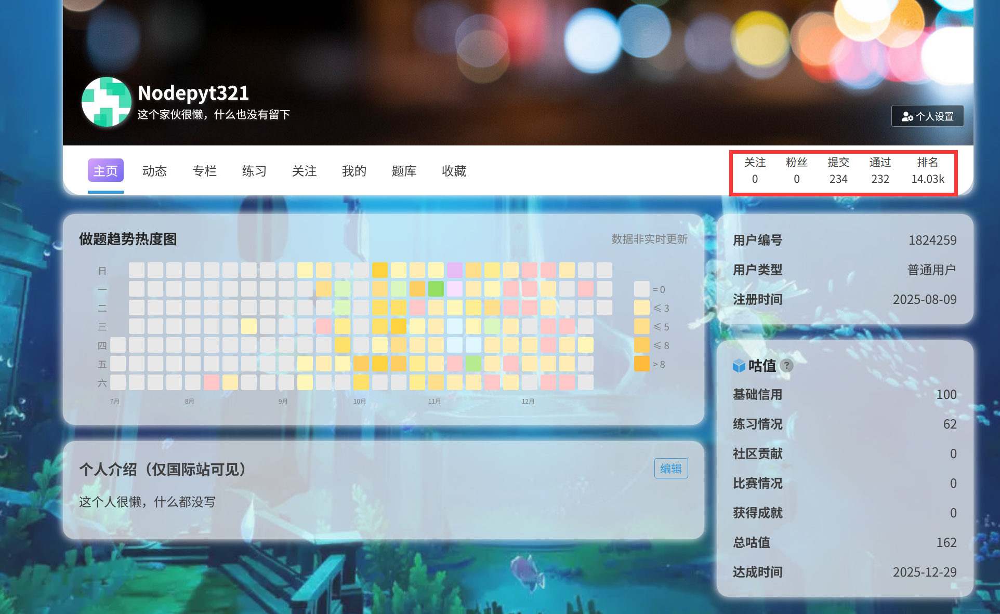
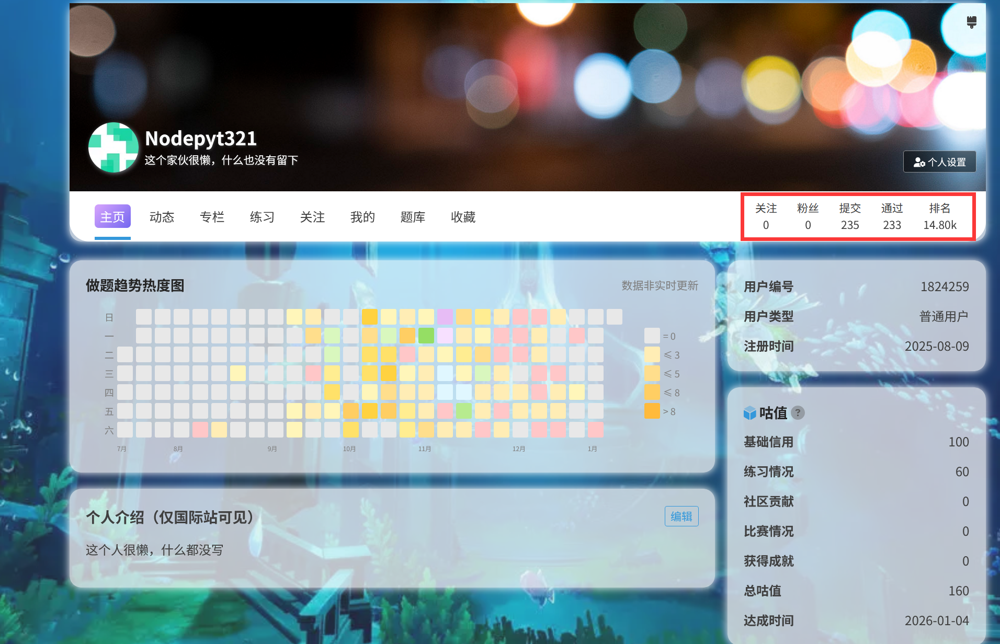
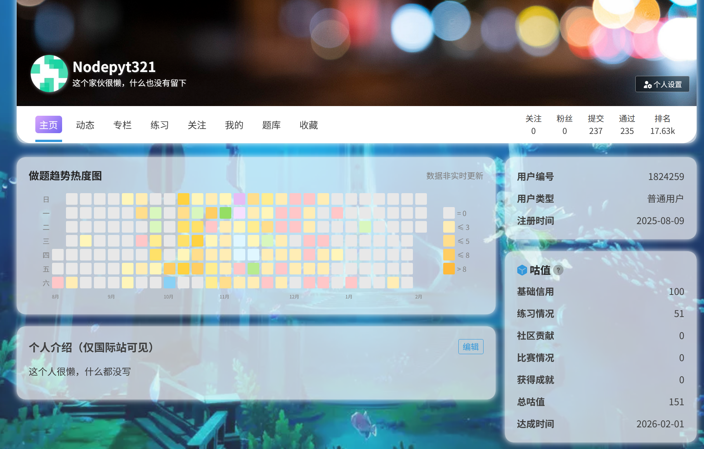

# 心情日记


## 1、2025/10/8  21:40

中秋节快乐！今天是个特别的日子，月亮又圆又亮，感觉心情也被照亮了。

有感而发：

```
今人不见古时月，今月曾经照古人。古人不见今时月，古月能否照来人？
```

gemini生图 (画于2026-02-20 22:55:00)：





网图：


## 2025.10.27

终于把洛谷刷绿了


日期：




绿了绿了





## 2025.11.1

牛客：大橘已定




## 2025 11 5 11:20

### AI 画图调教过程

me: 我想要以"绘事后素，惟妙惟肖"为主题做微信或者QQ的网名，请帮我想一想好听的名字，然后找找符合主题的好看的头像

混元模型：好的！“绘事后素，惟妙惟肖”出自《论语》与传统绘画美学，既有“先有素底，后施彩绘”的创作哲理，又强调“形神兼备、逼真传神”的艺术境界。结合这一意境，我为您精心设计了几组**网名建议**，并附上**头像风格推荐**，适用于微信、QQ等平台。

🌸 一、网名建议（古风雅致 + 现代简洁）

【古风意境型】

1. **绘事后素**（直接点题，简洁大气）
2. **素以为绚**（出自《论语》：“绘事后素”，子曰：“礼后乎？”——素底为本，绚烂其华）
3. **惟肖**（取自“惟妙惟肖”，简练含蓄）
4. **墨素生华**（墨色为素，却生出华彩）
5. **素缣绘梦**（缣：古代画绢；在素绢上绘梦）
6. **丹青未染**（丹青未上，素纸待绘，寓意初心与可能）
7. **形神俱妙**（强调“惟妙惟肖”的深层追求）

【文艺简约型】

 8. **素绘**
 9. **肖然**（谐音“萧然”，也有“惟肖自然”之意）
10. **绘素**
11. **素帧**（“帧”为画面单位，现代感+古典感融合）
12. **白描万象**（白描是中国画技法，以素线写万物）

【带符号/特殊格式（适合QQ/微信显示）】

13. **·绘事后素·**
14. **「惟肖」**
15. **✨素以为绚**
16. **▫️墨素▫️**


风格：现代插画，元素：山水，颜色倾向：轻彩。result:


## 2025.11.17 23：56 

完成`AcwingTemplate`算法基础课项目（肝死我了）

## 2025.11.23 23:00

今天真是耗尽了我了，早上在爬微信文章图片，下午1教606打造4，15点半左右回来，之后一直在优化分类模型框架代码。
本来框架搭的差不多了，但是看了一眼不好记录，因为所有配置文件集中在一个 `config.py`文件中，但是当实验多起来的时候就不知道不同类型实验之间的差别了。

参考了一下以前写的 TriLightNet 代码，发现使用了一个字典来记录不同实验的超参数配置，打算借鉴这个思路，改吧改吧一下子就 20 点了，真的烦。

后来又发现我现在只是想搭建一个框架，没必要写这么复杂，照上面的思路配置文件是一个字典会很长，并且代码一下子就很长了。框架嘛，本来我是想以简洁为主，但是写着写着不自觉就写了这么多代码，我曾多次想过美化代码、优化结构、清晰了然，然不尽人意，哎哎哎……

当时曾想过开一个新分支，后来想想太麻烦了算了。
最后妥协了，以现在的字典配置为主，总体来说利大于弊，想要改的话：
1、如果差不多的配置就直接改了
2、如果配置不同就复制、粘贴、修改配置，然后增删相应的代码

> 模型、损失函数、数据集定义、优化器、调度器、训练器Train定制化，每个模型都有独有的配置，这个写的我真是燃尽了。

晚上9点多回来，又要洗鞋、洗澡、洗衣服，哎，累累累……

## 2025.11.24

洛谷咕值新成就：151




晚上20:12，花了一个下午 + 晚上终于把二分查找的总结写完了。

## 2025.12.03 10:41

洛谷咕值更新了：157




## 2025.12.15 19:59

leetcode 刷题500道




## 2025.12.29

洛谷咕值更新了：162




## 2026.1.4 

洛谷咕值更新了：160，降了嘤嘤嘤




## 2026.02.04 16:16

洛谷咕值更新了：151，降了nonono




## 2026.03.29 22:34

<font color="#C908FC">今天杭州下沙气温17-25摄氏度，突然变热的，昨天开始就很热，我还穿着羊毛衫 + 厚外套。记录一下，算是冬天和~~春天~~哦不夏天的分界点。</font>

另外，记录一下：

今天是星期天，已经一个星期九点钟起了，继续努力，要成好习惯。

## 2026.05.17 19:33

构建了github仓库，记录一下：

note-harbor-backup, 备份了之前的笔记，特此记录。