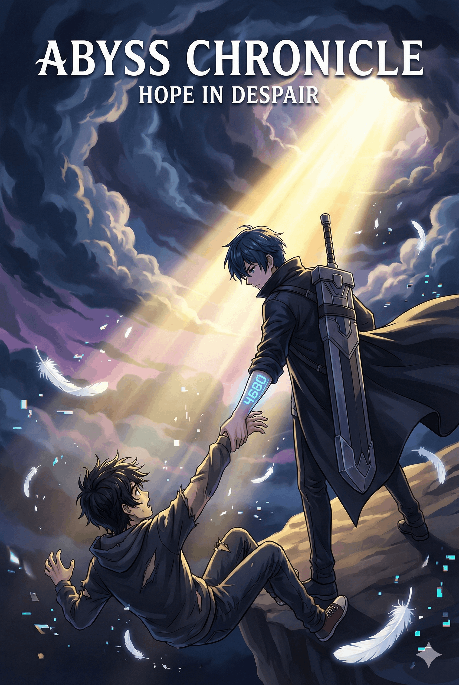

:::tip 前言

 
current time: 2026.02.18 10:42

说来话长，长话不短说。

2.17日明明是春节第一天，这一天玩的很开心，去了🐍 蛇蟠岛，走了朋友叔叔家拜年，晚上回来将昨天未完的左神的“单调栈上”学习完了，晚上却做了如此真实的梦，必须立马记录一下。

我昨天做了一个很真实的梦，很像一部小说，一下是关于梦的部分的回忆，请你通读全文，进行深度思考，将前后逻辑进行串联，构成一个完整的小说：

“我”是一位孤苦伶仃的小孩，从小没有父母，老师 “Z”帮我收养长大，供我上学读书。但是我在学校却不受待见，同学们都说我是无父无母，是克星。
有一天，我的一位稍微要好的朋友跟我说，"有一次我偶然听到老师们的谈话，你其实是他们学校 ‘麦斯’实验室的秘密武器。"我不信，老师"Z"对我这么好，怎么可能？但是在他的劝说下，我渐渐有所怀疑，所以我就是不是放学后在老师的办公室外面角落进行偷听。
直到有一次我听到老师们聊天：“这几年 ‘3395’ 的情绪渐渐稳定下来了，也不枉费我们的一番苦心”，“是啊，当初 章博士 造出来 ‘3395’ ，其他的方面都是不错，就是情绪上不太够，他越愤怒他的nt值就越高，足以毁灭整个城市或者国度。” “是啊，章博士对此不满意，前面3394个 nters 都没他抛弃了，他最后也把 ‘3395’ 抛弃了”。但是‘3395’不同，他的nt值是最大的，如果不加以控制，会出意想不到的灾难的。我们几个老人找了好几年，终于 老'z'找到了，把他安抚养大。
之间办公室门被缓缓打开，我冰冷的站在那里，然后跑走了，依稀听到 老师们的焦虑：快去找回来，不要在让他走丢。
过了一会儿，老师 'z'从后面温暖地抱住了我，轻声说道：'不要走好不好'。我愤怒的问：他们说的是不是真的？“是真的，章博士对你是虚情假意，但我对你是真的啊，你想想这几年”。忽然我的脑海中闪过了儿时的记忆……最后我被说服回去，答应老师们继续做实验。

有一次在课堂上被老师上台做实验，我的全身插满了各种线，当时我站在讲台的右边位置，前排的学生嫌弃地说：“站远一点”。我大声的过去怒吼：“你坐在这里，我就站在上面，你还要我站的多远，你说啊？”此话一出，几乎所有的同学全部跑出了教室，远远地透着窗户看着实验。
当我紧闭双眼，过了仅仅几秒钟，只听见老师说："实验失败了"。一切闹剧终于结束。
但是我的同学越来越过分，我的耐心一点一点地下降，终于我想通了，我要跳崖。当我站在崖顶的那一刻，一位 叫"inavailable"的拉住了我，他没有实体，自称是我的心魔，说：你真的没有朋友吗？我说：没有。然后一跃而下，最终被一位名为"剑圣"的救起，他和我是同类，说是‘4680’。

---

什么？你问封面是什么，纯图而已，就说好不好看吧，哈哈哈。

:::

# AI 脑补完善版本

## 豆包版

### 3395
我记事起，就没有家。

福利院的铁门换了三回，我辗转了四个寄养家庭，最后停在了Z老师身边。他是我就读中学的物理老师，眉眼总带着温和的暖意，冬天会把我冻僵的手揣进他的大衣口袋，会在我被别的孩子扔石头后，蹲下来替我擦干净脸上的泥，轻声说“有我在，没人能欺负你”。

他供我读书，给我一间能遮风挡雨的小房间，是我漂在这世上唯一的浮木。可校园里的恶意，从来没停过。走廊里擦肩而过的同学会刻意绕开我，背后的窃窃私语像针一样扎过来：“就是他，无父无母的克星”“听说克死了好几户收养他的人，难怪没人要”。

我攥紧书包带低头快步走过，只有Z老师送我的那支钢笔，被我攥得发烫。我总告诉自己，没关系，至少我还有Z老师。

唯一愿意和我多说几句话的，是同班的阿远。他不会像别人一样躲着我，偶尔会分我半块面包，会在别人骂我的时候，轻轻拉一下我的袖子让我别理。那天放学，他把我堵在楼梯间，脸色发白地犹豫了半天，才压低声音开口：“有次我去办公室交作业，听见几个老师在里面谈话……他们说，你根本不是孤儿，你是学校里‘麦斯’实验室的秘密武器。”

我第一反应是荒谬，一把推开他：“你胡说什么？Z老师养了我这么多年，怎么可能？”

“我也希望是我听错了。”阿远的声音带着急，“你就没觉得奇怪吗？为什么所有老师看你的眼神都不对劲？为什么从来没人敢罚你？为什么Z老师从来不让你碰实验楼的负一层？”

他的话像一颗石子，投进我心里那片看似平静的湖，漾开了层层叠叠的涟漪。那些我刻意忽略的细节瞬间涌上来：每次我情绪失控摔东西时，Z老师不是生气，是止不住的紧张；每次我生病，来的不是校医，是几个穿白大褂的陌生男人；我从来没见过自己的出生证明，Z老师说弄丢了，可他连我小时候掉的第一颗牙都好好收在盒子里。

怀疑的种子一旦种下，就疯了似的生根发芽。

从那天起，每天放学我都会绕到教师办公楼后侧，躲在Z老师办公室窗外的冬青丛里。那里堆着废弃的课桌椅，刚好能遮住我的身子。前三天，里面只有备课的翻书声和闲聊家常的动静，我甚至开始觉得，是阿远听错了，是我太多疑。

直到第四天傍晚，天阴沉沉地坠着雨意，办公室里聚了好几个老师，门虚掩着，声音透过门缝飘出来，一字一句砸在我的耳膜上。

“这几年3395的情绪总算稳定下来了，不枉费我们这一番苦心。”是教务处主任的声音，我认得。

3395？是什么？我屏住呼吸，指甲深深掐进掌心，渗出血珠都觉不出疼。

另一个苍老的声音接了话：“可不是嘛，当初章博士造出来3395，各项指标都完美，唯独情绪模块有缺陷。他越愤怒，体内的nt值就越高，峰值的时候，足以毁掉整座城市，甚至整个国度。”

“章博士那个完美主义者，怎么容得下瑕疵？前面3394个实验体，全被他销毁了。到了3395，他还是不满意，最后也把他扔了。”

“可3395不一样啊，他的nt阈值是所有实验体里最高的，一旦失控，后果不堪设想。我们几个找了整整三年，还是老Z先找到了他，把他带在身边养着，一点点磨平他的戾气，稳住他的情绪。”

“也只有老Z能镇住他了，毕竟这么多年的情分……”

后面的话我已经听不清了。耳朵里嗡嗡作响，像有无数只蜜蜂在里面横冲直撞。原来我连一个正经的名字都没有，我不是孤儿，是被人造出来的武器，是被抛弃的残次品。他们养我，不是心疼我，是怕我失控，怕我毁了这里。Z老师给我的所有温暖，全都是为了控制我这个“武器”演的戏。

办公室的门，在这时被缓缓拉开。

Z老师站在门口，脸上的温和瞬间褪去，只剩下震惊和慌乱。我僵在原地，浑身冰冷得像被扔进了寒冬的冰湖。下一秒，我转身就跑，用尽全身力气朝着校门的方向冲，身后传来老师们焦急的喊声：“快去找！别让他走丢了！千万别让他情绪失控！”

我跑出学校，沿着马路一直冲到江边的防洪堤，才扶着栏杆停下来大口喘气。江风刮在脸上像刀子一样疼，眼泪终于忍不住砸了下来。原来我活了十六年，全都是一场骗局。

身后传来急促的脚步声，我刚要再跑，一双温暖的手臂从身后轻轻抱住了我。是Z老师，他的大衣还带着熟悉的皂角香，和我小时候发烧时裹着我的那件一模一样。他的声音带着喘，还有我从未听过的慌乱与恳求，贴在我耳边轻声说：“不要走好不好？”

我猛地挣开他，红着眼睛浑身发抖，一字一句地问：“他们说的是不是真的？我是3395，是章博士造出来的实验体，是个武器，对不对？”

Z老师的眼神暗了下去，沉默了很久，最终轻轻点了点头。

“是真的。”他的声音很轻，却像重锤砸在我心上，“章博士对你，从头到尾都是虚情假意，他只把你当成一个失败的实验品。但我对你是真的啊。你好好想想，这十几年，我对你怎么样？”

他的话像一把钥匙，打开了我尘封的记忆闸门。三岁时我被扔在福利院门口，发着四十度的高烧，是他连夜把我抱去医院，守了我三天三夜，眼睛熬得通红；七岁时我被寄养家庭的孩子推下池塘，是他跳下去把我捞上来，抱着冻得发抖的我，说以后我就是他的孩子；十二岁我被高年级学生堵在巷子里打，他冲过来把我护在身后，后背挨了好几棍子，却回头笑着跟我说“没事，老师不疼”；无数个做噩梦的夜晚，他都坐在我的床边，轻轻拍着我的背讲故事，直到我睡着。

那些温暖，不是假的。

我攥着拳头，眼泪掉得更凶。一边是冰冷的真相，我是个没有过去、没有身份的实验体；一边是他给我的，我这辈子唯一拥有过的、家的感觉。最终，我还是跟着他回去了。我答应了那些老师，配合他们的实验，只要我还能留在他身边。

可从那天起，有什么东西，已经碎了。

我再也没法心安理得地接受Z老师的好，也再也没法无视那些落在我身上、看怪物一样的眼神。他们开始安排我做实验，有时候在实验楼的负一层，有时候，甚至就在课堂上。

那天的物理公开课，来了很多外校的老师，坐在教室后排。讲课的是麦斯实验室的研究员之一，他笑着让我走上讲台，说要给大家演示一个“特殊的物理实验”。

我站在讲台的右侧，冰冷的电极线一根接一根贴在我的身上，从额头到手臂到胸口，密密麻麻像一张网，把我困在里面。台下的闪光灯亮起来，我像个被放在展柜里的怪物，供人观赏。

前排那个最爱带头骂我的男生，皱着眉嫌恶地往后缩了缩，对着同桌用不大不小、刚好能让我听见的声音说：“让他站远一点，晦气。”

那句话像一根火柴，瞬间点燃了我心里积压了十几年的怒火。我猛地扯掉额头上的电极线，一步跨到他的课桌前，死死盯着他，用尽全力怒吼：“我站在讲台上，你坐在下面，你还要我站多远？你说啊！”

我的声音震得窗户玻璃嗡嗡作响，体内有什么东西在疯狂翻涌，耳边传来仪器刺耳的警报声。教室里瞬间死一般的寂静，下一秒，几乎所有同学都尖叫着站起来，疯了一样冲出教室，连后排的几个听课老师都变了脸色退到门外。最后，整个教室里，只剩下我，和讲台上脸色惨白的实验老师。

空荡荡的教室，窗外是密密麻麻的脑袋，所有人都隔着玻璃惊恐地看着我，像看一头随时会吃人的野兽。

我闭上了眼睛。

体内翻涌的、足以毁灭一切的力量，被我死死压了下去。疯狂攀升的nt值，在我的克制下一点点回落，最终归于平静。几秒钟后，我听见老师颤抖的、带着松了一口气的声音，对着对讲机说：“实验失败。”

闹剧终于结束了。我睁开眼，看着窗外那些躲闪的眼神，只觉得无比疲惫。原来在他们眼里，我哪怕只是愤怒地说一句话，都是一场需要严防死守的灾难。

从那以后，同学们对我的忌惮，变成了更变本加厉的恶意。他们会在我的课桌里塞死老鼠，会在我的课本上写满“怪物”“克星”，会在我路过的时候故意打翻水桶，让脏水泼我一身。Z老师替我出头了很多次，可只要他一转身，那些恶意就会像潮水一样再次涌过来。

我的耐心，一点点被磨没了。

我开始整夜整夜失眠，看着天花板问自己：我到底是谁？我活着，到底是为了什么？为了做一个被控制的实验品？为了活在别人的恐惧和厌恶里？还是为了那一点点掺着谎言的温暖？

我想不通。

那天早上，我又在课桌里发现了一只被踩死的小猫，血淋淋的，旁边用红笔写着“怪物就该和死东西待在一起”。那一刻，我心里最后一根弦，断了。

我走出了学校，没有回头，一路朝着城郊的望断崖走。那是本地最高的悬崖，下面是深不见底的峡谷，掉下去的人，从来没有活着回来的。我爬了三个小时的山路，终于站在了崖顶。

风从峡谷里吹上来，刮得我的衣服猎猎作响。脚下是万丈深渊，只要往前一步，所有的痛苦、所有的恶意、所有的身不由己，就都结束了。

就在我往前迈出半步的时候，一个虚无的声音，在我耳边响了起来。

“你真的要跳下去吗？”

我转过头，看见身边站着一个没有实体的半透明人影。他像一团雾气，看不清脸，声音却带着蛊惑，直直地钻进我的心里。“我叫inavailable。”他说，“我是你的心魔，是你藏在心底、不敢面对的自己。”

我笑了，笑得眼泪都出来了：“连心魔都来找我了，看来我真的是个怪物。”

“你真的没有朋友吗？”他又问，声音轻飘飘的，却戳中了我最痛的地方。

我看着脚下的深渊，轻声说：“没有。”

从来都没有。阿远在那次课堂事件之后，再也不敢和我说话了。Z老师的温暖，从一开始就带着目的。这世上，没有一个人，是真心接纳我的。

说完这句话，我张开双臂，往前一跃，纵身跳下了悬崖。风在我耳边呼啸，失重感包裹了我，我闭上了眼睛，心里却前所未有的平静。

终于要结束了。

可预想中的剧痛没有来。

一股强劲的风托住了我，下坠的势头骤然停住。我猛地睁开眼，看见一个穿着黑色劲装的男人抱着我，足尖踩着一柄泛着寒光的长剑，稳稳地停在半空中。他的眉眼很锋利，身上有和我同源的、熟悉的气息。

他落在崖边的平地上，把我放了下来，看着我惊魂未定的脸，勾了勾唇角，声音低沉有力：“小家伙，年纪不大，脾气倒是不小，说跳就跳？”

我愣在原地，看着他：“你是谁？为什么救我？”

“他们都叫我剑圣。”他拍了拍我的肩膀，眼神里带着我从未见过的、同类的了然，“我的编号，是4680。”

4680。和3395一样的，编号。

我猛地抬头看着他，浑身都在抖。原来我不是唯一一个，原来我不是孤单一人。

他看着我震惊的样子，笑了笑，转身朝着崖下的路走去，回头朝我抬了抬下巴：“走了。章博士欠我们的，还有这个世界欠我们的，总该要回来。总不能白来这世上一遭，对吧？”

风停了，阳光穿过云层，落在他的身上，也落在我的身上。我站在原地，看着他的背影，攥紧了拳头。十六年的骗局，十几年的恶意，满身的伤痕，在这一刻，终于有了不一样的出口。

我抬步，跟了上去。

## gemini版

### 小说名：《代号：3395》

### 第一章：温暖的培养皿

在这个世界上，我是一个多余的人。
没有父母，没有家族，我的记忆起点就是孤儿院那面斑驳的白墙，直到Z老师出现。Z老师并不像其他大人那样用审视货物的眼神看我，他的眼神里有一种让我心安的狂热。他收养了我，供我读书，给我买合身的校服。

在很长一段时间里，他是我在这个冰冷世界里唯一的篝火。

然而，学校是另一回事。孩子们有着比成人更敏锐的直觉，他们能嗅出“异类”的气息。
“离他远点，他是天煞孤星。”
“听说靠近他的人都会倒霉。”
我习惯了这种被孤立的生活，直到那个稍微要好的朋友——阿文，打破了沉默。

那天放学，阿文鬼鬼祟祟地把我拉到操场角落，他的声音在颤抖：“你以为你是运气不好才没有父母吗？我……我那天去办公室交作业，听到他们在谈论你。”
我皱眉：“谈论什么？”
“麦斯实验室。”阿文咽了口唾沫，“你是他们制造出来的……秘密武器。”

我推了他一把，笑道：“你科幻小说看多了，Z老师对我恩重如山。”
但我笑不出来。怀疑的种子一旦落下，就会在心里长出荆棘。

### 第二章：隔墙有耳

那个傍晚，夕阳像凝固的血块挂在天边。我并没有回家，而是像一只幽灵一样潜回了教学楼。
Z老师的办公室门虚掩着，里面传出茶杯碰撞的脆响，还有陌生的交谈声。我缩在走廊尽头的阴影里，屏住了呼吸。

“……各项数据都很完美，这几年‘3395’的情绪终于稳定下来了。”一个苍老而陌生的声音说道，“真不枉费我们这么多年的苦心经营。”

“是啊。”那是Z老师的声音，带着一种从未对我展示过的冷酷，“当初章博士造出‘3395’时，追求的是极致的破坏力。其他的指标都还算像个人，唯独情绪模块……章博士设计了一个‘NT阈值’（Neuro-Turbulence，神经湍流值）。他越愤怒，体内的NT值就越高，理论上足以毁灭整个城市，甚至一个国家。”

我的心脏猛地收缩，手脚冰凉。

“可惜啊，”那个陌生人叹息，“这种力量太不可控。前面3394个‘Nters’（实验体）都因为无法承载这种能量被销毁了。章博士也没耐心了，最后把‘3395’也当成废品抛弃了。”

“但他不一样。”Z老师的声音提高了几分，“他的NT潜质是最大的。如果不加以控制，任由他流落在外，那就是一颗行走的核弹。我们这几个老骨头找了好几年，终于让我找到了。把他当普通孩子安抚养大，用‘爱’作为枷锁，才是控制这件兵器的最好方式。”

吱呀——
风吹动了窗户，或者是我的颤抖碰到了门板。办公室的门缓缓打开了一条缝。
我就站在那里，眼神空洞地看着他们。
里面的两个老人猛地回头，原本慈祥的面孔瞬间扭曲成惊恐。
“他听到了！”
“快！别让他跑了！如果不受控就麻烦了！”

我转身狂奔。在那一刻，我不是我，我是第3395号废品，是一个随时会爆炸的怪物。

### 第三章：虚假的拥抱

我跑得肺部像火烧一样，但我怎么可能跑得出那精心设计的牢笼？在学校后花园的死胡同里，我停下了脚步。
脚步声逼近。
过了一会儿，一双手从后面温柔地抱住了我。那是无数次在深夜给我盖被子的手，是无数次抚摸我头顶的手。

“不要走，好不好？”
Z老师的声音在我耳边响起，带着恳求，甚至有一丝哽咽。

我浑身僵硬，猛地转过身，泪水在眼眶里打转，愤怒像火焰一样灼烧着理智：“你们刚才说的，是不是真的？我是不是什么‘3395’？我是不是个兵器？”

Z老师看着我，并没有撒谎。他叹了口气，眼神里流露出一种极其复杂的、令人窒息的深情。
“是真的。”
那三个字像锤子一样砸碎了我的世界。
“但是，孩子，你要明白。”Z老师抓着我的肩膀，指甲几乎嵌入我的肉里，“章博士创造了你，但他对你是虚情假意，他只在乎数据！但我对你是真的啊！你想想这几年，谁给你做饭？谁陪你过生日？如果我只把你当实验品，我为什么要花那么多心血？”

我的脑海中闪过儿时的记忆：高烧时他焦急的脸庞，第一次考满分时他骄傲的笑容……
我的愤怒在这一刻变得无力。我是一个渴望爱的怪物，哪怕这份爱是掺了毒药的蜜糖，我也无法拒绝。

“我不走。”我低声说。
我被说服了。或者说，我认命了。

### 第四章：实验失败

回归意味着不再掩饰。学校撕下了伪装，变成了真正的实验室“麦斯”。
那是一次公开的“压力测试”。
在我的课堂上，讲台变成了实验台。我被迫站在右侧，全身插满了花花绿绿的导线，连接着后方巨大的显示屏。
Z老师拿着记录板站在一旁，面无表情。
台下坐满了同学——或者说，观察员。他们的眼神不再是单纯的厌恶，而是赤裸裸的嫌弃和恐惧。

“啧，能不能站远点？”前排的一个男生捂着鼻子，像是闻到了垃圾的臭味，“怪物身上的电波会辐射到我们吧？”

这句话像一根针，刺穿了我仅存的尊严。羞耻感在血管里翻涌，变成了滚烫的怒火。
既然你们说我是兵器，那我就展示给你们看！
我猛地冲向那个男生，身上的导线被扯得笔直，发出崩裂的声响。我冲着他的脸咆哮，声嘶力竭：
“你坐在这里！我就站在讲台上！你还要我站多远？！你说啊！！”

吼声在教室里回荡。
那一瞬间，仿佛空气都凝固了。紧接着是恐慌爆发。
“啊——！他要失控了！”
“快跑！NT值要爆表了！”
同学们尖叫着，桌椅被掀翻，他们争先恐后地逃出教室。仅仅几秒钟，教室空了。他们趴在走廊的窗户上，远远地看着我，像看一只关在笼子里即将发狂的野兽。

我站在原地，喘着粗气，紧闭双眼。我想象着体内那股足以毁灭城市的力量喷涌而出，将这所虚伪的学校夷为平地。
毁灭吧，都毁灭吧。
我等待着爆炸，等待着终结。

滴——
几秒钟后，仪器发出了一声平淡的长鸣。
Z老师冰冷的声音传来：“NT值波动未达标。能量聚集不足。实验失败。”

我睁开眼。
没有爆炸，没有火光。教室依然完好无损。
连做怪物，我都是失败的。那一刻，比愤怒更深的，是彻骨的绝望。一场闹剧，终于结束。

### 第五章：无效个体（Inavailable）

实验失败后，我在他们眼中连“危险”都算不上了，只剩下“恶心”。同学们的欺凌变得肆无忌惮，Z老师看着我的眼神也充满了失望。
我的耐心一点一点下降，不是对别人的耐心，而是对活着的耐心。

终于，在一个阴沉的午后，我想通了。既然我是个错误，那就由我自己来修正。
我来到了学校后山的悬崖顶端。风很大，吹得校服猎猎作响。前方是深不见底的云雾，跳下去，一切归零。

“你真的想好了吗？”
一个声音突兀地响起。
我回过头，看到一团模糊的人形黑影漂浮在岩石边。他没有实体，像是由在那台显示屏上乱码组成的幽灵。
“你是谁？”
“我是‘Inavailable’。”黑影的声音直接在我的脑海中回响，“我是你的心魔，也是刻在你基因里的系统状态——‘不可用’。”
他飘到我面前，空洞的面部仿佛有一双眼睛在注视我：“你真的没有朋友吗？在这个世界上，真的没有一个人值得你留恋吗？”

我想起了那个告密的阿文，想起了利用我的Z老师，想起了那些逃跑的同学。
“没有。”我平静地回答，“我是多余的。”

Inavailable 似乎发出了一声叹息，然后缓缓退开，把通往深渊的路让了出来。

### 第六章：同类的剑

我闭上眼，向前迈出一步。
身体失重，风声呼啸。死亡并没有想象中那么可怕，反倒有一种解脱的轻盈。

就在我以为我会粉身碎骨的那一刻，一股巨大的力量突然从半空中截住了我！
并没有坠地的剧痛，我落入了一个坚硬、冰冷却有力的怀抱。
“轰！”
那是落地时的冲击声，但那人稳稳地接住了我，我们落在悬崖底部的一块巨石上。

我惊魂未定地睁开眼。
抱着我的，是一个看起来和我年纪相仿的少年。他背着一个巨大的长条形匣子，眼神凌厉如刀。他的身上穿着我不认识的制服，在破损的袖口处，露出手腕上一行泛着幽蓝光芒的编号：**4680**。

“你是谁？”我虚弱地问。
少年将我放下，从背后的匣子中抽出了一柄充满科技感的长剑。剑锋震鸣，仿佛在渴望战斗。
他抬头看向悬崖上方，那里隐约传来Z老师和警卫们的追捕声。

“我是‘剑圣’。”少年淡淡地说道，嘴角勾起一抹狂傲的笑意，“也就是第4680号。”
他转过头，向我伸出了手：“章博士以为把你抛弃就结束了，但他忘了，失败品也会进化。我们是同类，3395。”

我看着他的手，那是第一次，我感觉握住的不是虚假的温暖，而是冰冷的希望。
故事，才刚刚开始。